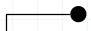

## Modelo Conceitual e logico

#### Modelo Conceitual:

-> Entidade

 
    

 

-> Relacionamento

 
    

 

-> Atributo

 
    

 

-> Atributo indentificador

 
    

 

-> Generalização

 
    

 

#### Diagrama do modelo conceitual:

<h1 align="center">
  
</h1>
 

#### Diagrama do modelo logico relacional:

<h1 align="center">
  
</h1>
